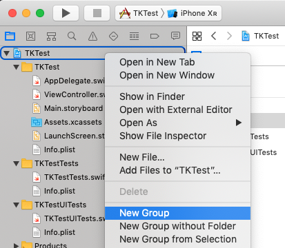
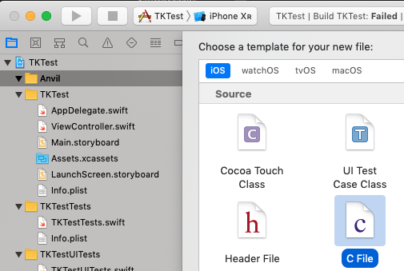
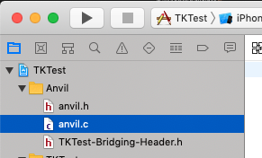
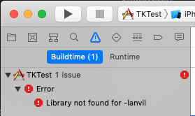
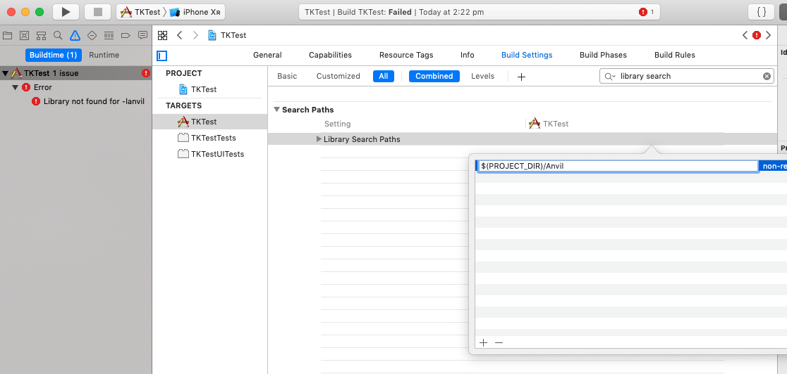

# 02 - Cross-compiling for Xcode

## Overview

* Build a universal `anvil` library for iOS devices
* Create an Xcode project and a C header
* Include the static library and run it

## Instructions

In the `anvil` project directory, create builds for each of the iOS platforms:

<pre>$ <b>cargo build --target aarch64-apple-ios</b>
$ <b>cargo build --target x86_64-apple-ios</b></pre>

You can verify the output for each architecture using `lipo` if you wish:

<pre>$ <b>lipo -info target/aarch64-apple-ios/debug/libanvil.a</b>
Non-fat file: target/aarch64-apple-ios/debug/libanvil.a is architecture: arm64</pre>

<pre>$ <b>lipo -info target/x86_64-apple-ios/debug/libanvil.a</b>
Non-fat file: target/x86_64-apple-ios/debug/libanvil.a is architecture: x86_64</pre>

Use `lipo` to combine them into a universal library in the `target/` subdirectory:

<pre>$ <b>lipo -create target/aarch64-apple-ios/debug/libanvil.a target/x86_64-apple-ios/debug/libanvil.a -output target/libanvil.a</b>
$ <b>lipo -info target/libanvil.a</b>
Architectures in the fat file: target/libanvil.a are: x86_64 arm64</pre>

Create a new Single View iOS app project in Xcode, using the language Swift.

Right click on the top-level project and create a new Group called `Anvil`.



Right click on the group and chose **New File...**. Add a new C file called `anvil.c`, and tick the box to "also create the header file".



When you are asked if you want to configure an Objective-C bridging header, choose **Create Bridging Header**.


There should be three files in the new group. Delete `anvil.c`. We will not need it.



Open the header file `anvil.h` and replace Xcode's generated boilerplate with a function prototype:

```c
void hello_devworld();
```

Then in the auto-created bridging header (`TKTest-Bridging-Header.h` in the picture above), add a line to bring your header into Swift.

```c
#include "anvil.h"
```

Locate the universal library `target/libanvil.a` in Finder and drag it into the `Anvil` group inside Xcode. In the dialog box that pops up, check the box to **Copy items if needed**. Make sure the checkbox is selected to add it to the main app target (`TKTest` in this example).

Choose an iOS simulator and try to run the app. It might work. Or if you added the library slightly differently, it may fail to link:



If you see this problem, manually add the location of the library as a search path.

* Select the project (**TKTest**) then the target **TKTest**.
* Select **Build Settings**
* Select the **All** filter so advanced settings are displayed.
* Search for the term `library search`
* Double click on the empty setting and add a single entry containing `$(PROJECT_DIR)/Anvil` - this is the path to the `Anvil` folder within your iOS project.



Your app should now build and run - but it doesn't do anything yet! In `ViewController.swift`, modify `viewDidLoad()` to call the library function:

```swift
    override func viewDidLoad() {
        super.viewDidLoad()
        // Do any additional setup after loading the view.
        hello_devworld()
    }
```

Run the app again. Now whatever your library chose to print should appear in Xcode's console.

Congratulations! You've run your first Rust code on iOS!

## Exercises

### 1. Use a physical iPhone or iPad

In general you need to be a paid-up member of Apple's iOS development program to deploy to physical hardware. You will need to change the target configuration so that the app is part of that team and has a registered App ID.

At the time of writing (August 2019) Rust and LLVM have bitcode compatibility problems ([Rust issue](https://github.com/rust-lang/rust/issues/35968), [detailed analysis](https://jira.hyperledger.org/browse/IS-1261?attachmentOrder=asc)). Therefore **for now you must disable bitcode in the Build Settings of your app**.


With that change in place you should be able to run your app as normal on a real iThing. Xcode will automatically pull the correct architecture from the universal Rust library.

### 2. Create both Debug and Release builds

The performance of Rust code is often dramatically lower in Debug builds. It achieves full speed in Release mode but this comes at the cost of longer compilation times. If you want to you can supply both Debug and Release builds to Xcode and it will choose the matching ones depending on whether you're doing a Debug or Release build inside Xcode.

To create release builds of your Rust library, pass the `--release` flag to cargo. Be careful: the compiled libraries will now be under `target/<arch>/release` instead of `debug`!

<pre>$ <b>cargo build --release --target aarch64-apple-ios</b></pre>

In Xcode you can change your search path depending on the mode:


Try to get both types built and working! If you change the print-out before you do the release build, that might make it easier to tell if it worked...
